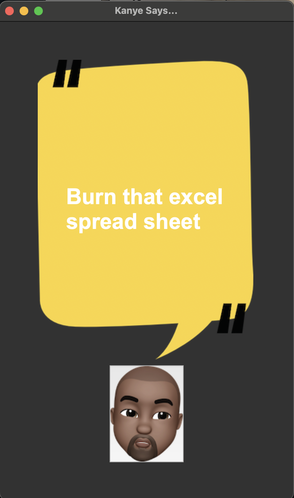

# Random-Kanye-Quotes
A mock project done as part of Angela Yu's python course. It's all a joke. The app uses rest api to randomly pull a kanye quote and run it on the basic UI application.

You need python and pip install package support to install the requests module if you don't have it. Tkinter usually comes installed with most python versions. After installing, you should be able to run the application using the trivial command: 
```
python main.py
```
The application window should look something like this: 



Kanye also said, <i>“I don’t want to say these really big, over-the-top statements that end up getting quoted.”</i>

Oh well. 
